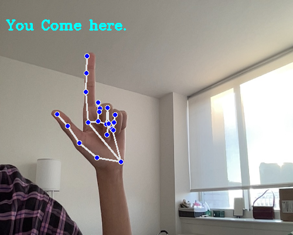
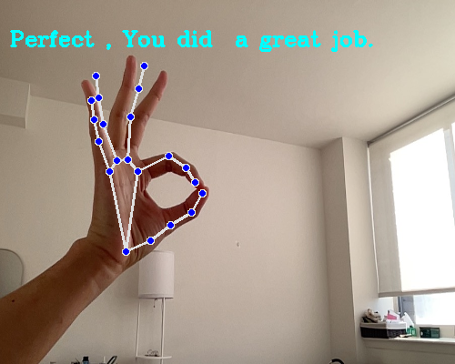
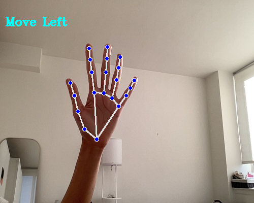
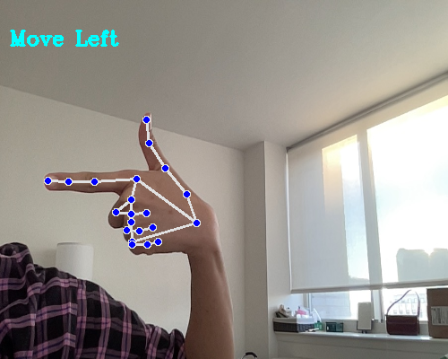
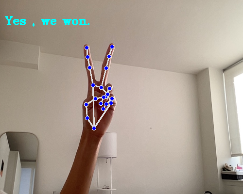

# Containerized App Exercise

## **Overview**

The ASL Interpreter app leverages **machine learning** to recognize **American Sign Language (ASL)** gestures from live camera feeds. Designed with **accessibility** in mind, this app provides a seamless, containerized experience using three main components:  

- **Gesture Recognition**  
- **Web Interface**  
- **Database**  

### **Features**  

Our app can recognize the following ASL gestures:

<div align="center">
  
  
  
  <br>
  
  
</div>


## Demo

Get a glimpse of the app in action:  

<div align="center">
  
</div>

## **Getting Started**

### **Prerequisites**
Ensure the following are installed on your system:

- **[Docker](https://www.docker.com/products/docker-desktop)**  
  Download and install Docker Desktop for your operating system.  

- **[Docker Compose](https://docs.docker.com/compose/install/)**  
  Follow the official Docker Compose installation guide. 

### Setup and Run
1. First, clone the repository into your preferred IDE or terminal.

    ```bash
    git clone <repository-url>
    cd <repository-folder>
    ```

2. Build and start the app using Docker Compose:

    ```bash
    docker-compose up
    ```

    This will start all three containers.

3. Open the app in your browser at: 

    **http://localhost:5002/**

4. Allow camera access when prompted for gesture recognition.

### Stoppping the Containers
-  Stop all containers:

    ```bash
    docker-compose stop
    ```

- Stop and remove containers:

    ```bash
    docker-compose down
    ```

## Meet the Team

[Safia Billah](https://github.com/safiabillah)

[Melanie Zhang](https://github.com/melanie-y-zhang)

[Chloe Han](https://github.com/jh7316)

[Fatima Villena](https://github.com/favils)

## Project Management

Check out our [Task Board](https://github.com/orgs/software-students-fall2024/projects/119/views/1) for progress tracking.
